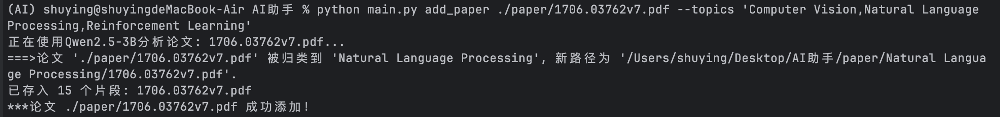
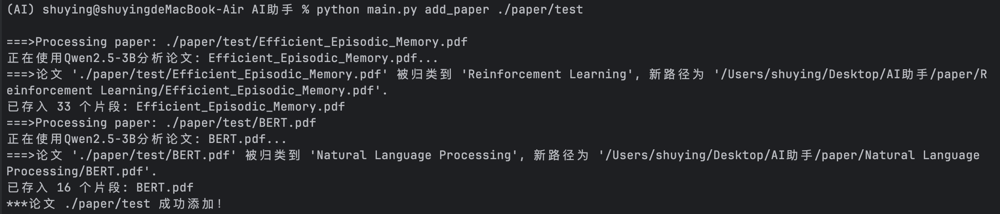
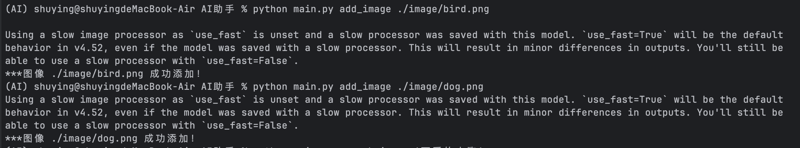
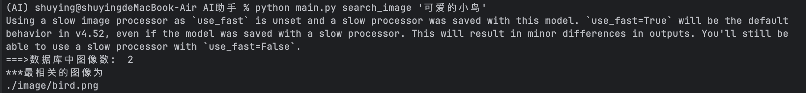

# 多模态机器学习-本地多模态 AI 助手

### 项目介绍

本项目是一个基于 Python 的本地多模态 AI 智能助手，旨在解决本地大量文献和图像素材管理困难的问题。不同于传统的文件名搜索，本项目利用多模态神经网络技术，实现对内容的**语义搜索**和**自动分类**。智能文献管理：支持对 PDF 论文的语义搜索（不仅是关键词匹配）和基于内容的自动分类整理。

### 核心功能

#### 2.1 智能文献管理

*   **语义搜索**: 支持使用自然语言提问（如“Transformer 的核心架构是什么？”）。系统需基于语义理解返回最相关的论文文件，可返回具体的论文片段或页码。
*   **自动分类与整理**:
    *   **单文件处理**: 添加新论文时，根据指定的主题（如 "CV, NLP, RL"）自动分析内容，将其归类并移动到对应的子文件夹中。
    *   **批量整理**: 支持对现有的混乱文件夹进行“一键整理”，自动扫描所有 PDF，识别主题并归档到相应目录。
*   **文件索引**: 支持仅返回相关文件列表，方便快速定位所需文献。

#### 2.2 智能图像管理

*   **以文搜图**: 利用多模态图文匹配技术，支持通过自然语言描述（如“海边的日落”）来查找本地图片库中最匹配的图像。


### 实验环境 

操作系统: macOS，Python 版本: 3.9。


#### 核心模型

LLM: Qwen2.5-3B-Instruct (运行于 Ollama)

Text Embedding: paraphrase-multilingual-MiniLM-L12-v2

Image Embedding: clip-ViT-B-16

向量数据库: ChromaDB (本地持久化)

### 环境搭建流程

#### 基础环境准备

使用 Anaconda 创建conda环境。

#### 创建虚拟环境:

```bash
conda create -n AI python=3.9
conda activate AI
```

#### 依赖库安装

安装项目所需的 Python 库。

```bash
pip install -r requirement.txt
```

#### Ollama 本地大模型配置

Ollama 用于在本地低显存环境下高效运行大语言模型， 从 ollama.com 下载并安装 macOS 版本。

拉取模型: 打开终端运行以下命令，下载Qwen2.5-3B。

```bash
ollama pull qwen2.5:3b
```

### 项目结构说明

项目目录结构如下：

```tex
AI助手/
├── database/              # ChromaDB 数据库自动生成的存储目录
├── image/                 # 图像素材
├── paper/                 # 论文
│   ├── Computer Vision/
│   ├── Natural Language Processing/
│   ├── Reinforcement Learning/
│   ├── test/
├── image.py               # 图像添加、检索
├── llm.py                 # 调用Qwen实现精确文本分类
├── paper.py               # 论文添加、分类、检索
├── main.py                # 命令行统一入口
├── requirement.txt        # 环境文件
└── README.md              
```

### 功能测试与使用

#### 功能一：单文件添加与归类

自动读取 PDF，并将其按页划分进行片段存储，通过Qwen2.5-3B判断其属于 NLP, CV 还是RL，并将其移动到对应文件目录下。

示例:

```bash
python main.py add_paper ./paper/1706.03762v7.pdf --topics 'Computer Vision,Natural Language Processing,Reinforcement Learning'
```

运行结果:



#### 功能二：批量文件整理

对 ./paper/test 文件夹下的所有文件进行整理，并归档到正确类别的文件夹下。

示例:

```bash
python main.py add_paper ./paper/test
```

运行结果:

#### 

分类后的文件夹结构：


#### 功能三：语义搜索相关论文

根据输入的 query 检索数据库中最相关的论文，并返回对应的页码与论文片段。

示例：

```bash
python main.py search_paper 'Transformer的核心架构是什么'
```

运行结果：


#### 功能四：单图像文件添加

将图像文件添加到数据库中。

示例：

```bash
python main.py add_image ./image/bird.png
```

运行结果:



#### 功能五：以文搜图

支持通过自然语言描述（如“海边的日落”）来查找本地图片库中最匹配的图像。

示例：

```bash
python main.py search_image '可爱的小鸟'
```

运行结果：


